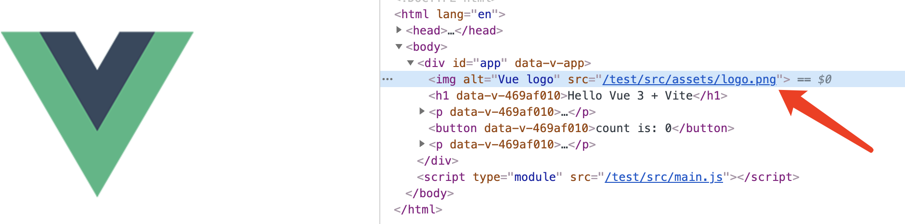

# vite-base-full-url
set full url in vite, but seems not work in development, I need the src is full url including host

```javascript
export default defineConfig({
  base: 'http://localhost:3000/test/',
  plugins: [vue({
    template: {
      transformAssetUrls: {
        base: 'http://localhost:3000/test/',
      }
    }
  })]
})

```

But the vue log `src` is not full url.


